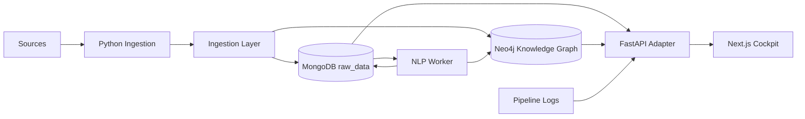

# Review architetturale completa

## Sintesi

Il progetto è una mini data intelligence platform. Non è solo una dashboard: raccoglie dati da più sorgenti, li salva in MongoDB, li proietta in Neo4j, li arricchisce con NLP e li rende interrogabili.

## Punti forti

1. **MongoDB + Neo4j è una scelta corretta**
   - MongoDB conserva payload grezzi e flessibili.
   - Neo4j rappresenta relazioni tra Event, Company, Topic, Industry e Sector.

2. **Dual-write sensato**
   - UUID comune tra documento MongoDB e nodo Neo4j.
   - Buona base per coerenza e tracciabilità.

3. **Pipeline modulare**
   - Ogni sorgente ha uno script dedicato.
   - Il sistema è estendibile.

4. **Pagina confronto MongoDB vs Neo4j**
   - Forte valore didattico.
   - Dimostra quando usare document store e quando graph database.

## Punto debole principale

La dashboard Streamlit comunica prototipo. Il progetto merita una UI da prodotto: dark cockpit, API layer, componenti riusabili, graph view interattiva.

## Architettura proposta

