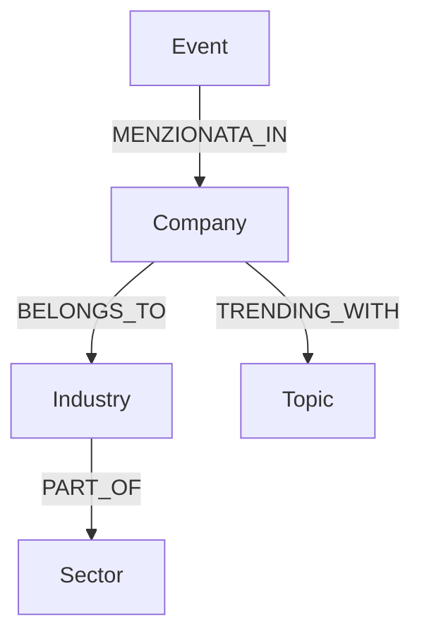

# Schema MongoDB / Neo4j

## MongoDB raw_data

```json
{
  "_id": "uuid4",
  "source": "newsapi | reddit | youtube | gdelt | yfinance | google_trends",
  "data_type": "event | social | ohlcv | trend",
  "ingested_at": "ISO datetime",
  "payload": {}
}
```

## Neo4j



## Query co-menzioni

```cypher
MATCH (c1:Company)<-[:MENZIONATA_IN]-(e:Event)-[:MENZIONATA_IN]->(c2:Company)
WHERE c1.ticker < c2.ticker
RETURN c1.ticker, c2.ticker, count(e) AS weight
ORDER BY weight DESC
```
